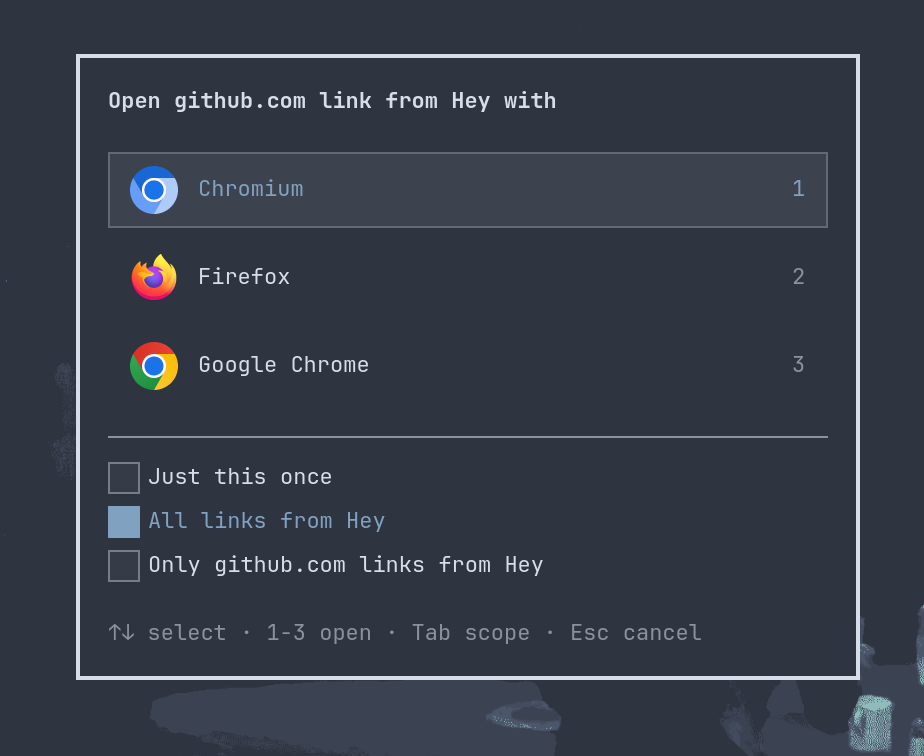

# omaroute

Per-app link routing for [Omarchy](https://omarchy.org) (Hyprland), in the spirit of [Choosy](https://choosy.app/) and [Velja](https://sindresorhus.com/velja).



omaroute registers itself as your default browser. When you click a link, it looks at which app the click came from and opens the link in the browser you chose for that app. The first time it sees a new app (or domain), it shows a small centered picker. Your choice can be remembered, so you are only asked once.

- Route links per app (Slack → Chrome), per domain (`github.com` → Firefox), or per app + domain.
- Themed picker that follows your Omarchy shell theme automatically.
- Plain-TOML config you can edit by hand or sync in your dotfiles.
- Small, fast, no daemon: it runs only when a link is clicked.

## Contents

- [Requirements](#requirements)
- [Install](#install)
- [Uninstall](#uninstall)
- [Usage](#usage)
- [CLI reference](#cli-reference)
- [Rules and precedence](#rules-and-precedence)
- [Configuration](#configuration)
- [Theming](#theming)
- [How it works and limitations](#how-it-works-and-limitations)
- [Security](#security)
- [Development](#development)
- [Troubleshooting](#troubleshooting)

## Requirements

- Omarchy / Arch Linux (x86_64) running Hyprland. Outside Hyprland omaroute still works, but it can't tell which app a link came from, so only domain rules and the default browser apply.
- `gtk4` and `gtk4-layer-shell` (runtime).
- `cargo` (Rust, edition 2024) to build from source.
- `xdg-utils` (`xdg-settings`) for registering as the default browser. `libnotify` (`notify-send`) is optional and is used for error notifications.
- At least one other browser installed whose desktop entry is in the `WebBrowser` category.

## Install

### Option 1: build the package with makepkg (recommended)

```sh
git clone <this repository> omaroute
cd omaroute
makepkg -si
omaroute setup
```

The package installs `/usr/bin/omaroute` and `/usr/share/applications/omaroute.desktop`.

### Option 2: build from source

```sh
cargo build --release --locked
./target/release/omaroute setup
```

`setup` writes a desktop entry to `~/.local/share/applications/omaroute.desktop` that points at the binary you ran it from, so keep the binary where it is, or copy it somewhere permanent (for example `~/.local/bin`) and run `setup` from there.

### What `setup` does

1. Writes the user-level desktop entry (`x-scheme-handler/http` and `https`).
2. Saves your current default browser to `~/.local/state/omaroute/previous-browser` (only if omaroute is not already the default).
3. Refreshes the desktop database.
4. Runs `xdg-settings set default-web-browser omaroute.desktop`.

You can confirm with `xdg-settings get default-web-browser`, which should print `omaroute.desktop`.

## Uninstall

1. Restore your previous default browser and remove the files `setup` created:

   ```sh
   omaroute setup --undo
   ```

   This runs `xdg-settings set default-web-browser <previous>`, then deletes `~/.local/share/applications/omaroute.desktop` and the saved previous-browser state.

2. Remove the program:

   ```sh
   sudo pacman -Rns omaroute          # if installed with makepkg
   # or, if built from source, delete the binary you copied/ran
   ```

3. Optional: delete your rules.

   ```sh
   rm -r ~/.config/omaroute
   ```

If `setup --undo` could not find a saved browser, pick one yourself with `xdg-settings set default-web-browser <name>.desktop` or from Omarchy's settings.

## Usage

Just click a link in any app.

- If a rule matches, the link opens straight away in the configured browser.
- Otherwise the picker appears:

| Key | Action |
| --- | --- |
| `↑` / `↓` | Move the selection |
| `Enter` | Open in the selected browser |
| `1`–`9` | Choose that browser directly |
| `Tab` | Cycle the remember scope (see below) |
| `Esc` | Cancel; nothing is opened |

The scope controls what gets remembered:

| Scope | Effect |
| --- | --- |
| Just once | Open this link only; save nothing |
| All links from the app | Rule for `--app` only |
| Only this domain from the app | Rule for `--app` + `--domain` |
| This domain, any app | Rule for `--domain` only |

## CLI reference

```
omaroute <url> [--app NAME]                      open a link (this is what the system calls)
omaroute list                                    show rules
omaroute browsers                                show installed browsers
omaroute set [--app A] [--domain D] <browser>    add/replace a rule
omaroute unset [--app A] [--domain D]            remove a rule
omaroute default [browser|--clear]               get/set the fallback browser
omaroute setup [--undo]                          register as default browser
omaroute --help | --version
```

Browser names are desktop-entry IDs as printed by `omaroute browsers`. The `.desktop` suffix is optional. `--app` and `--domain` values are lowercased.

### Examples

```sh
omaroute browsers                                  # list usable browsers (id<TAB>name)

omaroute set --app slack google-chrome             # everything from Slack -> Chrome
omaroute set --app slack --domain github.com firefox
omaroute set --domain example.org chromium         # example.org from any app

omaroute unset --app slack                         # remove the Slack-wide rule
omaroute unset --app slack --domain github.com

omaroute default firefox                           # never prompt; fall back to Firefox
omaroute default                                   # print the current fallback
omaroute default --clear                           # go back to prompting

omaroute list                                      # e.g. "app=slack domain=* -> google-chrome.desktop"

omaroute 'https://example.com' --app slack         # open a URL as if it came from Slack
```

`--app` takes the Hyprland window class of the app. Find it with `hyprctl clients` (look at `class:`), for example `slack`, `discord`, `thunderbird`, `com.mitchellh.ghostty`.

## Rules and precedence

When a link arrives, the first match wins:

1. App + domain
2. App only
3. Domain only (any app)
4. Default browser (`omaroute default`)
5. Otherwise, show the picker

Domain rules match the domain and its subdomains (`github.com` matches `gist.github.com`, but not `notgithub.com`).

## Configuration

`~/.config/omaroute/config.toml` (respects `$XDG_CONFIG_HOME`). It is written atomically with mode `0600`. You can edit it by hand:

```toml
default = "firefox.desktop"

[[rule]]
app = "slack"
browser = "google-chrome.desktop"

[[rule]]
app = "slack"
domain = "github.com"
browser = "firefox.desktop"

[[rule]]
domain = "example.org"
browser = "chromium.desktop"
```

A malformed config is ignored when opening links (a warning is printed and the picker is used), while CLI commands report the error.

Related paths:

| Path | Purpose |
| --- | --- |
| `~/.config/omaroute/config.toml` | Rules and default browser |
| `~/.local/share/applications/omaroute.desktop` | Desktop entry created by `setup` |
| `~/.local/state/omaroute/previous-browser` | Your previous default browser, used by `setup --undo` |

## Theming

The picker follows the Omarchy shell theme, like the launcher and clipboard menus. On every launch it reads the `[menu]` colors and alphas, the Hyprland border, and `[font] base-size` from the current theme's `shell.toml`, with `~/.config/omarchy/shell.toml` layered on top. No template or `omarchy-theme-set` step is needed; switching themes just works.

## How it works and limitations

Linux gives a URL handler no information about who sent the link. omaroute uses the **focused Hyprland window class** at click time (queried over the Hyprland IPC socket). This means:

- Links opened by background processes (or while you are focused on a different window) are attributed to whatever is focused.
- Outside Hyprland there is no app information; only domain rules and the default apply.
- Use `omaroute <url> --app NAME` to override the detected app.

omaroute only sees links that an app hands to the system (via `xdg-open` or the default-browser setting). Some apps never do, so omaroute can't route their links:

- **Chromium web apps (`--app` windows)**: Chromium often opens external links in its own browser instead of calling `xdg-open`, so omaroute never sees the click.
- **Electron and other apps**: these should go through `xdg-open`. If one doesn't, it may be caching the old default browser or using its own link handler; check its settings and restart it after running `omaroute setup`.

To check whether an app reaches omaroute, run `journalctl --user -f | grep -i omaroute` and click a link in it. If nothing shows up, the app is not calling omaroute.

## Security

- Only `http` and `https` URLs are accepted; whitespace/control characters are rejected.
- Browsers are launched through GIO desktop entries; no shell is involved.
- The URL is passed to the browser untouched; only the host is parsed, for rule matching.
- The config is written atomically with mode `0600`.
- omaroute refuses to route to itself.

## Development

```sh
cargo build            # debug build
cargo test             # unit tests + CLI integration tests (no display needed)
cargo run -- list      # try CLI commands
cargo build --release --locked
```

### Running the tests

```sh
cargo test                  # everything: unit tests + CLI integration tests
cargo test --bin omaroute   # unit tests only (src/**)
cargo test --test cli       # integration tests only (tests/cli.rs)
cargo test precedence       # only tests whose name contains "precedence"
cargo test -- --nocapture   # show output from passing tests
```

No Wayland session, installed browsers or real config are needed. Tests use temporary HOME/XDG directories, fake browsers, stubbed `xdg-settings`/`notify-send`, and a fake Hyprland socket, so they never touch your real setup or send notifications. The one thing not covered is the GTK picker window itself.

Tests also run automatically on every push and pull request via GitHub Actions (`.github/workflows/test.yml`).

Layout:

| File | Role |
| --- | --- |
| `src/main.rs` | CLI parsing, `setup`, link handling |
| `src/config.rs` | Config file, rule resolution |
| `src/url.rs` | URL validation and host extraction |
| `src/source.rs` | Focused-app detection via Hyprland |
| `src/picker.rs`, `src/theme.rs`, `data/picker.css` | GTK4 layer-shell picker and theming |
| `data/omaroute.desktop` | Desktop entry template |
| `src/test_support.rs`, `tests/` | Unit-test helpers; `tests/cli.rs` drives the real binary in a sandbox (fake browsers, stubbed `xdg-settings`/`notify-send`, fake Hyprland socket) |
| `PKGBUILD` | Arch package |

## Troubleshooting

- **Links don't go through omaroute**: run `xdg-settings get default-web-browser`; it should print `omaroute.desktop`. If not, run `omaroute setup` again.
- **"no browsers found"**: install a browser whose desktop entry has the `WebBrowser` category; check with `omaroute browsers`.
- **Wrong app is detected**: check the class with `hyprctl activewindow`, and use that exact (lowercase) value in `--app`.
- **"unknown browser"**: use an ID from `omaroute browsers`.
- **Moved the binary after `setup`**: re-run `omaroute setup` from the new location so the desktop entry's `Exec` path is updated.

## License

[MIT](LICENSE)
